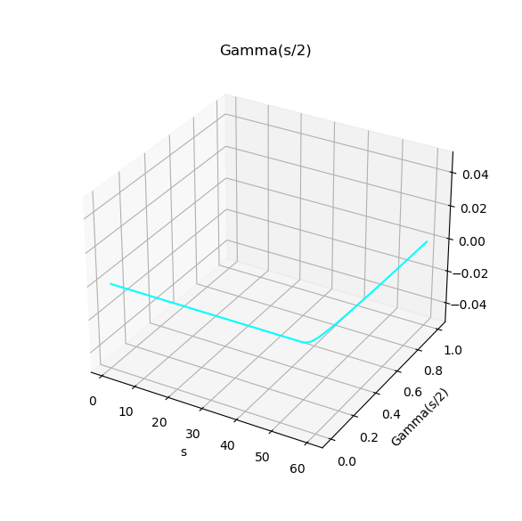
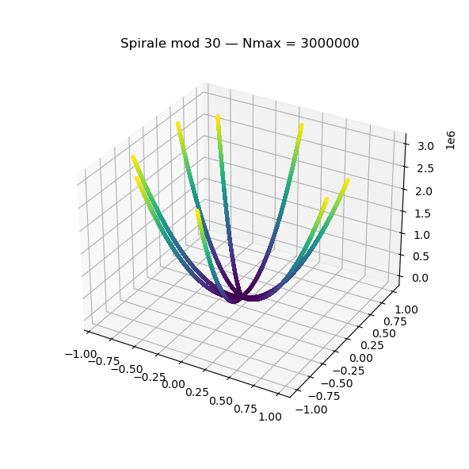

# Scientific Report — Station Monfette Pro

**Generated on:** 2026-05-21 03:33:24.940811

**N max analyzed:** 3000000

---

## 1. Spiral mod 30

- Variance: **69.967918**

- Active tunnels: **11**

## 2. Gamma(s/2)

- Max: **1.000000**

- Min: **0.000000**

- Peaks: **2**

## 3. Spiral × Gamma Fusion

- Vertical continuity: **0.000000**

## 4. Goldbach Analysis

- Average: **0.193085**

- Minimum: **0.000000**

- Maximum: **2.000000**

## 5. Adelic Analysis

- Corr(Euler, Gamma): **-0.000000**

- Corr(Gamma, Goldbach): **0.000000**

- Corr(Euler, Goldbach): **0.002974**

